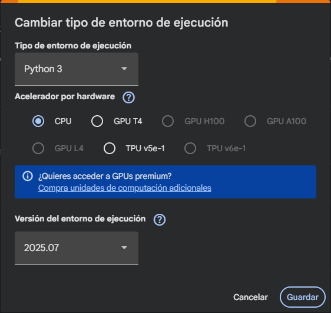

# SAC_Spark
RDD implementation of Dijkstra algorithm

Apache Spark assignment for Sistemes Actuals de Computació

---

## Use

This project may be run on any environment suporting [Jupyter Notebook](https://jupyter.org/). However, it is recommended to use [Google Collab](https://colab.google/), thus avoiding problems related to specific operating systems or dependencies.

> ⚠️ To ensure correct functioning, the environment version might be set to `2025.07`, as shown in the image below.

---

## Introduction

This repository offers an implementation of **Dijkstra's shortest-path algorithm** with [Apache Spark](https://spark.apache.org/). It features a **weighted directed graph** representing a map of interconnected cities, where the vertices are the cities and the edges the roads between them. Each edge has a positive weight assigned representing the distance between its two vertices.

The main goal is to implement this popular algorithm using Spark primitives for distributed systems. The primitives used in this case are:

- `parallelize`: splits the data, in this case the graph, in different parts, each to be computed by a different node of the distributed system. The data is transformed to `RDD` (Resilient Distributed Dataset), so it can be distributed across the different nodes.
- `filter`: selects from a `RDD` the elements matching a predicate and returns a new `RDD` containing them.
- `reduce`: performs an operation on a `RDD` and outputs an aggregated result.
- `map`: performs an transformation upon all the elements of a `RDD` and returns a new `RDD` with each element transformed.
- `collect`: joins the spread data of a `RDD` together on a single node.

---

## Design decisions

For the development of this simulation the following decisions have been made:

- **Programming language:** The project is fully developed in [Python](https://www.python.org/) via **Jupyter Notebook**, due to the easy use of **Apache Spark** it provides thanks to the `PySpark` framework.

---

## Code structure

### The graph

To create the graph, the [NetworkX library](https://networkx.org/en/) has been used, for it is especially suited for data structures such as graphs. Using this library's `DiGraph` class, a **directed weighted graph** is created as a list of tuples, where each tuple contains three elements:
- A `string` with the name of a node of the graph.
- Another `string` with the name of another node of the graph.
- A `float` with the weight of the edge between the two previous nodes.

---

### The RDD

In order to apply the Spark operations more easily, the previous graph is transformed in a **key-value** structure, since `RDD` operations require this type of data structure. Thus, the nodes are arranged in a list where each element (node) is respresented the way `('node_name', ([neighbors], smallest_cost, visited?, [path]))`, where:
- `node_name` is the name of the node, acting as the **key** of the structure.
- The **value** is a tuple of 4 elements:
    - `neighbors`: a list of tuples, each containing the name of a neighbor and the weight of the edge to it.
    - `smallest_cost`: the smallest cost found to reach the node currently, which is updated through the algorithm iterations.
    - `visited?`: boolean flag to indicate whether the node has been already been visited (`True`) or not (`False`).
    - `path`: list with current shortest path to this node from the starting node, formed with the names of the nodes.

This new structure is also stored as a `dict` to facilitate some internal operations.

---

### Dijkstra's distributed algorithm

- **Initialization:**
    - All nodes are marked as **non-visited**.
    - All current paths are initialized as an empty list.
    - The starting node is assigned a smallest_cost of 0, and the rest are initialized with `inf`.

- **Iteration:**
    1. Select the **unvisited nodes** from the `RDD` with a `filter` transformation.
        - If there are no unvisited nodes, **the algorithm ends**.
    2. Find the **next node** to visit, which is the one with the **lowest cost**. To do that, perform a `reduce` operation on the unvisited nodes `RDD`. Mark this node as **visited**.
    3. From the new node, **find only the neighbors with a lower cost path** found. Those are found with a `filter` transformation upon all the unvisited nodes.
    4. **Update** the previously found neighbors performing a `map` transformation on each one with the new costs.
    5. **Update the full graph** for the next iteration. A `collect` is performed the join all the scattered nodes.

---

## Final considerations

The **distributed approach** to Dijkstra's shortest path algorithm allows for some **benefits** such as the breakdown of the problem in smaller parts that can be computed parallely by different nodes of the system and the fact that each node does not need to have all the information of the system, making it more memory efficient and, in a real case scenario, perhaps taking advantage of the  proximity principle if the graph is worldwide. However, there are also some **drawbacks**, such as the high computational cost of operations like `reduce` and, specially, `collect`, that require joining information from different nodes that might be scattered across a large territory; fortunately, the `RDD` datastructure is prepared to handle consistency issues in this regard.

This implementation might not be the most optimal because the udpate of the whole graph at the end of each iteration, for the `collect` operation might be trivial in small grafs like the ones presented in this simulation, but **scales poorly** as graphs get larger and larger. For a real world scenario, it would be better to find a solution where the transitions between iterations don't require to collect the data from the whole distributed system and thus taking full advantage of this type of architecture where each node only requires its starting partition of the data to work until the end of the algorithm. 
